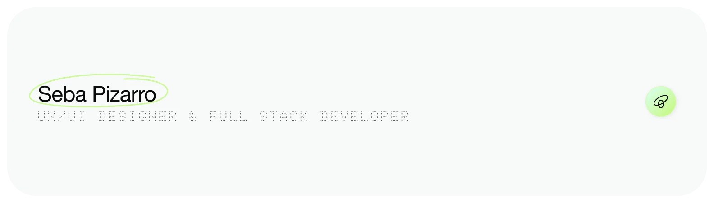

<!-- 

<h1 align="center">Hola, soy <a href="https://sebapizarro.com" target="_blank">Seba Pizarro</a> 👋</h1>

 -->

### ¡Hola! Soy [Seba Pizarro](https://sebapizarro.com) 👋 
#### Full Stack Developer Junior & UX/UI Designer

 

#### 👨🏻‍💻 Acerca de mi
Me especializo en acortar la brecha entre el **diseño centrado en las personas** y la **implementación técnica**. Mi objetivo es crear experiencias digitales que no solo se vean atractivas y modernas, sino que sean altamente funcionales, accesibles y escalables.

- 🌝 Diseñador y desarrollador web
- 🌚 Metiendo las manos en el backend
- 🧐 Mi foco en un producto es la visión, calidad y empatía
- 📱 Mi página web [sebapizarro.com](https://sebapizarro.com)
- 🤓 Siempre aprendiendo
 

#### 🎨 Mi Valor Agregado*

- **Diseño centrado en el usuario:** Creación de interfaces intuitivas, prototipos y sistemas de diseño basados en necesidades reales.
- **Frontend fiel al diseño:** Capacidad de traducir código visual (Figma) a maquetación HTML/CSS impecable, limpia y adaptable.
- **Crecimiento continuo (Backend):** Incursionando en tecnologías backend para entender y construir productos digitales de extremo a extremo (End-to-End).

 

#### 💼 Mi Stack*
##### **Diseño UX/UI**

##### **Frontend (Dominio)**

##### **Backend & BD (En Aprendizaje)**

 

#### 🚀 Proyectos Destacados

| Tipómetro - Calculadora de interlineado | API REST con Node.js, Express y PostgreSQL |
| :---: | :---: |
|  |  |
|  |  |
| Herramienta web interactiva diseñada para ayudar a diseñadores y desarrolladores a calcular el interlineado (*line-height*) tipográfico óptimo. | Proyecto backend de operaciones CRUD para gestionar usuarios mediante una API REST con Node.js, Express y PostgreSQL. |

 

#### 📬 ¡Conectemos!

* 💼 **LinkedIn:** [linkedin.com/in/sebastian-pizarro-rojas](https://www.linkedin.com/in/sebastian-pizarro-rojas)
* 🎨 **Behance:** [behance.net/sebaspizar5e84](https://www.behance.net/sebaspizar5e84)
* 💻 **Página web:** [sebapizarro.com](https://sebapizarro.com)

<!--
**SebaPizarroR/SebaPizarroR** is a ✨ _special_ ✨ repository because its `README.md` (this file) appears on your GitHub profile.

Here are some ideas to get you started:

- 🔭 I’m currently working on ...
- 🌱 I’m currently learning ...
- 👯 I’m looking to collaborate on ...
- 🤔 I’m looking for help with ...
- 💬 Ask me about ...
- 📫 How to reach me: ...
- 😄 Pronouns: ...
- ⚡ Fun fact: ...
-->
